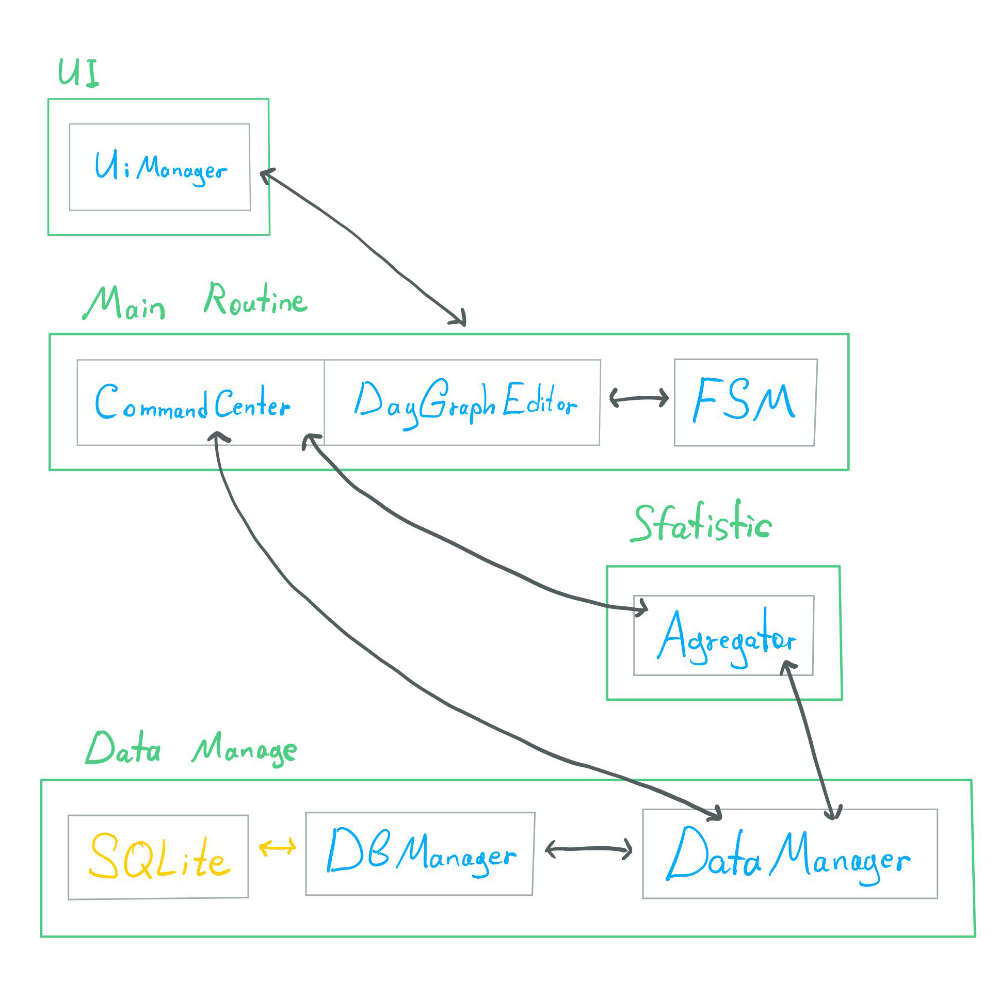
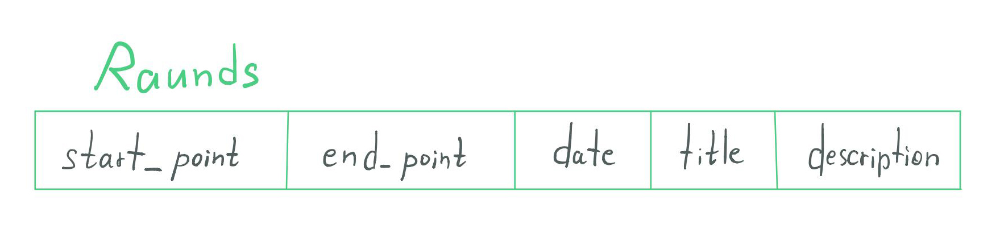
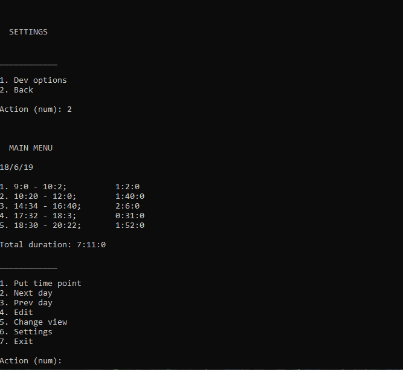

# TimeTracker

Program created for tracking work time, easy use - just start and stop tracking. Might see in day, week and month view. Plus see statistic of productivity and other indicators (not yet availabel).

Mostly I made it for myself ^__^. Cause functionality is simple, but I absolutely do not like all apps for Android, iOS, Windows. And I just decide made it yourself from scratch on pure C++, for now how console app.

## Architecture

**FSM:** main lifetime loop.

**UiManager:** all information output happening here.

**CommandCenter:** contain all basic commands.

**DayGraphEditor:** run loop inside FSM, for editing operations with raunds: delete, edit, manual creating.

**DataManager:** work with data without direct interactions with database.

**DbManager:** direct work with SQLite.

## Data

**Main entities:**
* **Raund** - main data entity (struct), contain: DateTime, duration(int), title(string), description(string).
* **DateTime** - main entity for time and date, contain: Date{day, month, year}(struct), Time{hour, minute, second}(struct), raw time for <ctime> routine and set of functions for seconds math and conversions.

Raunds collect to list and form graphs: "Day graph" - list of Raunds, "Week graph" - list of "Day graphs", "Month graph" - list of simplified Raunds (all names are conditional and don't use as entities in program).

**Table structure:**

**Converting Raunds for table:**
* **start_point** - amount of seconds from 00:00
* **end_point** - amount of seconds from 00:00
* **date** - raw time of current day from 00:00
* **title** - title string
* **description** - description string

## FSM

Main loop based on statements. Via <istream> user select needed action(<State>), input is processing and change to selected <State> by key.

Each *<State>* have:
* *name key*
* *list of <State>* for change from current state
* *specific command* for activate selected State feature

## What I learn

* FSM basic
* Work with <ctime>
* C++ SQLite library

## Possible developement

* Android app
* Maby iOS app
* full Windows app with GUI

## Future updates

* Edit raunds
* Manual raunds creation
* Extend raunds with title and description
* Settings
* Work statistic